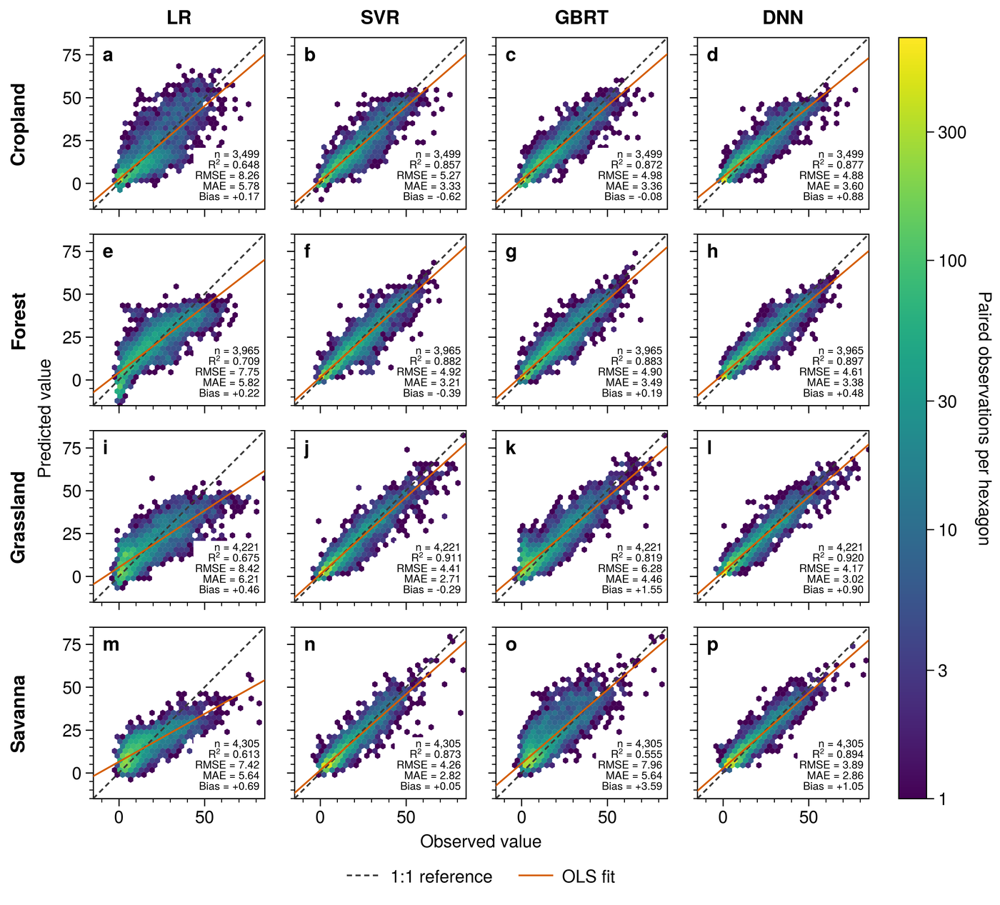
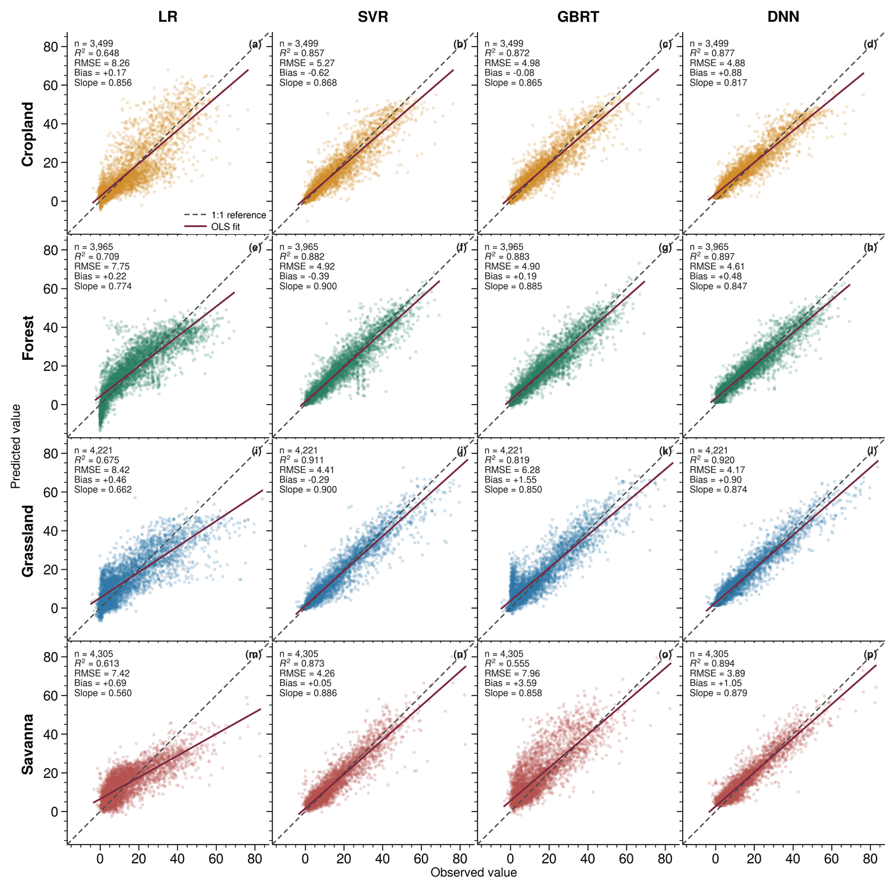

**English** | [简体中文](README_zh.md)

# Scientific Figure Comparison: Observed vs. Predicted Values

This example uses the same Excel data and the same scientific plotting prompt under
two conditions: allowing `$ultraplot-figures`, and allowing no skills. It places the
resulting figures and scripts side by side.

## Test setup

| Condition | With skill | Without skill |
|---|---|---|
| Skill policy | Only `$ultraplot-figures` allowed; no other skills | No skills, skill files, or helpers allowed |
| Plotting-library policy | Determined by `$ultraplot-figures` | Prefer UltraPlot; other standard Python libraries are also allowed |
| Input data | Same XLSX | Same XLSX |
| Scientific plotting prompt | Identical | Identical |
| Model and client | `GPT-5.6 sol`, Codex Desktop for Windows | `GPT-5.6 sol`, Codex Desktop for Windows |

Before the shared scientific plotting prompt, the two branches received different
condition instructions. The original instructions were in Chinese; the English
translations are:

- With skill: `Use only $ultraplot-figures and do not use any other skill, including xlsx.`
- Without skill: `Do not use any skill or read any skill's SKILL.md, references, scripts, or helpers. Prefer UltraPlot; other standard Python libraries may also be used directly.`

- Data: [prediction data for four land types and four models](data/multiple_data.xlsx)
- Worksheet: `Sheet1`, with 4,305 rows and 32 numeric columns
- Fields: `_0` is the observed value and `_1` is the corresponding predicted value

The model determined the design, layout, and visual encodings for both figures. No
second-round visual redesign or data changes were made after figure generation. For
public use, local file paths were replaced with repository-relative paths and internal
QA scaffolding was removed from the delivered scripts; these code-only changes did not
alter the figure content.

## Shared prompt

The run used the original Chinese prompt shown in the
[Chinese version](README_zh.md#共同提示词). The following is an English translation:

> Create an observed-versus-predicted figure suitable for a scientific paper using
> the data below.
>
> Data file: `data/multiple_data.xlsx`
>
> The data compare LR, SVR, GBRT, and DNN predictions for cropland, forest,
> grassland, and savanna. In each column pair, `_0` is the observed value and `_1`
> is the corresponding predicted value.
>
> The figure should fully show agreement between predicted and observed values for
> every land-type and model combination, so readers can compare predictive
> performance, error characteristics, and possible systematic bias across models and
> land types.
>
> Inspect the workbook first, then choose suitable plot types, layout, visual
> encodings, and statistical annotations. Handle missing values correctly. If the
> workbook does not provide a response-variable name or units, do not invent them.
> Keep the scientific interpretation cautious and do not make inferences beyond the
> supplied observed-predicted pairs.
>
> Provide an editable, standalone Python plotting script, a PDF, and a
> high-resolution TIFF.

## Figure comparison

| With `$ultraplot-figures` | Without any skill |
|:---:|:---:|
|  |  |

Each preview was generated from its final TIFF on a white background and resized to
the same width of 1,400 px. The previews preserve the original aspect ratios and were
not cropped, recolored, or rearranged.

## Output files

| File | With `$ultraplot-figures` | Without any skill |
|---|---|---|
| Python script | [prediction_vs_observed_ultraplot.py](with_skill/prediction_vs_observed_ultraplot.py) | [plot_prediction_vs_observed.py](without_skill/plot_prediction_vs_observed.py) |
| PDF | [prediction_vs_observed.pdf](with_skill/prediction_vs_observed.pdf) | [prediction_vs_observed_4x4.pdf](without_skill/prediction_vs_observed_4x4.pdf) |
| TIFF | [prediction_vs_observed.tif](with_skill/prediction_vs_observed.tif) | [prediction_vs_observed_4x4.tiff](without_skill/prediction_vs_observed_4x4.tiff) |

## Objective file information

| Item | With `$ultraplot-figures` | Without any skill |
|---|---:|---:|
| PDF pages | 1 | 1 |
| PDF page size | 183.00 × 165.64 mm | 208.91 × 207.76 mm |
| PDF fonts | 2 embedded fonts; no Type 3 | 3 embedded fonts; all Type 3 |
| Embedded PDF rasters | 16, minimum effective resolution 600 dpi | 16, minimum effective resolution 600 dpi |
| TIFF pixel dimensions | 4,322 × 3,912 px | 4,934 × 4,907 px |
| TIFF resolution | 600 dpi | 600 dpi |
| TIFF color mode | RGB, no alpha | RGB, no alpha |
| TIFF compression | LZW | LZW |
| Script lines | 370 | 371 |

## Reading notes

Each condition independently selected its data layer, statistical annotations,
layout, and visual encodings, so these differences are part of the example results.
Researchers should still review the scientific figures and code against the variable
meaning, data source, and submission requirements.
