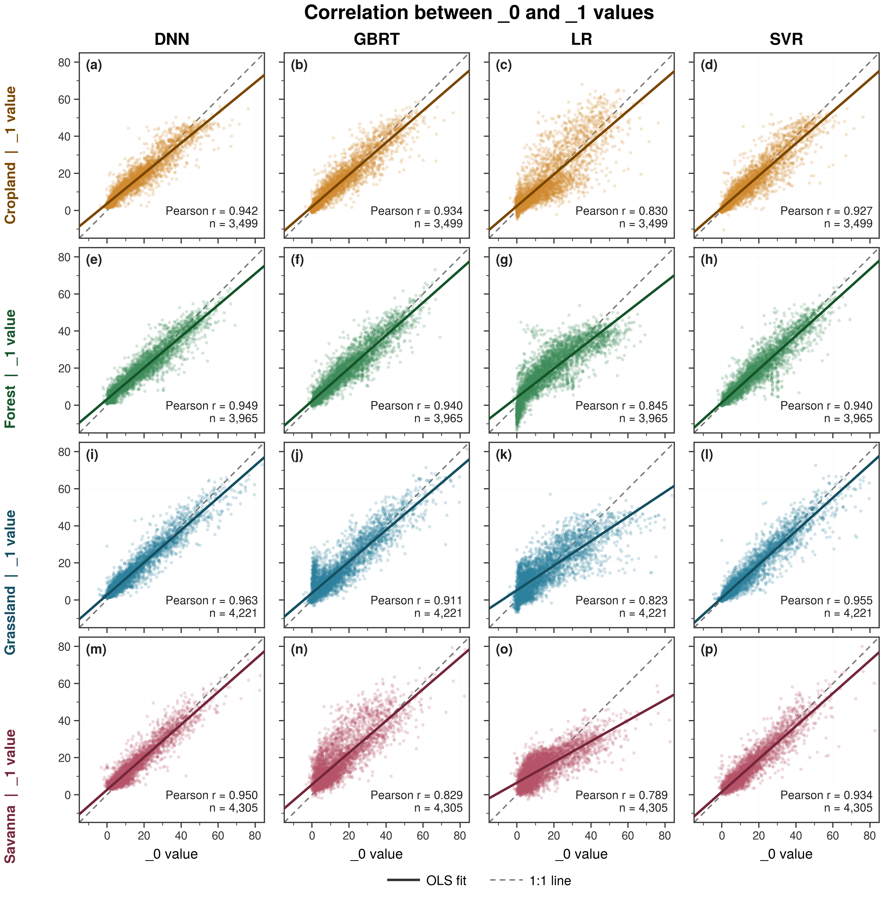

**English** | [简体中文](README_zh.md)

# UltraPlot Skill A/B Test: Correlation Scatter Plot

## Experiment provenance

- Each condition was generated in a fresh, projectless Codex task with no
  inherited conversation history.
- The four overall tests were run sequentially. Each task had its own directory
  and input copy and could not read completed sibling runs.
- The skill-disabled task could not read any skill. The skill-enabled task could
  read the skill instructions, while the skill `examples/` directory remained
  inaccessible during generation.
- Both correlation conditions received byte-identical workbook content. The
  artifacts were copied into this example only after the isolated runs finished.
- The controlled prompt factor was whether `$ultraplot-figures` was explicitly
  invoked.

## Input data

- Workbook: [multiple_data.xlsx](data/multiple_data.xlsx)
- Worksheet and shape: `Sheet1`, 4,305 rows × 32 numeric columns
- Structure: four land covers × four models × paired `_0` and `_1` fields
- Land covers: `cropland`, `forest`, `grassland`, `savanna`
- Models: `DNN`, `GBRT`, `LR`, `SVR`
- Complete pairs per land cover: 3,499, 3,965, 4,221, and 4,305;
  63,960 finite pairs across all 16 land-cover/model combinations

## Prompt control

The prompt text below is restored from repository history. The input file is
shown using its repository-relative path to avoid exposing machine-specific
information. The full effective prompt for each condition consists of its
condition-specific instruction plus the common task below.

The common task was:

> Plotting data file: `data/multiple_data.xlsx`
>
> Create a publication-ready correlation scatter plot comparing `_0` and `_1`
> for DNN, GBRT, LR, and SVR across cropland, forest, grassland, and savanna.
>
> Provide directly runnable Python code and export PDF and PNG.

Only the plotting instruction changed:

| Condition | Plotting instruction |
|---|---|
| Skill enabled | `Use [$ultraplot-figures](../../SKILL.md) to create the plot.` |
| Skill disabled | `Use UltraPlot to create the plot.` |

## Figure comparison

### Skill enabled

### Skill disabled

## Output files

| Artifact | Skill enabled | Skill disabled |
|---|---|---|
| Analysis and plotting | [correlation_scatter.py](with_skill/correlation_scatter.py) | [correlation_scatter_ultraplot.py](without_skill/correlation_scatter_ultraplot.py) |
| PDF | [correlation_scatter.pdf](with_skill/correlation_scatter.pdf) | [correlation_scatter_ultraplot.pdf](without_skill/correlation_scatter_ultraplot.pdf) |
| PNG | [correlation_scatter.png](with_skill/correlation_scatter.png) | [correlation_scatter_ultraplot.png](without_skill/correlation_scatter_ultraplot.png) |

## Objective output information

| Item | Skill enabled | Skill disabled |
|---|---:|---:|
| PDF pages | 1 | 1 |
| PDF page size | 182.9996 × 184.9787 mm | 191.7302 × 194.5358 mm |
| PNG dimensions | 7,204 × 7,282 px | 4,529 × 4,595 px |
| PNG resolution metadata | 999.998 dpi | 599.999 dpi |
