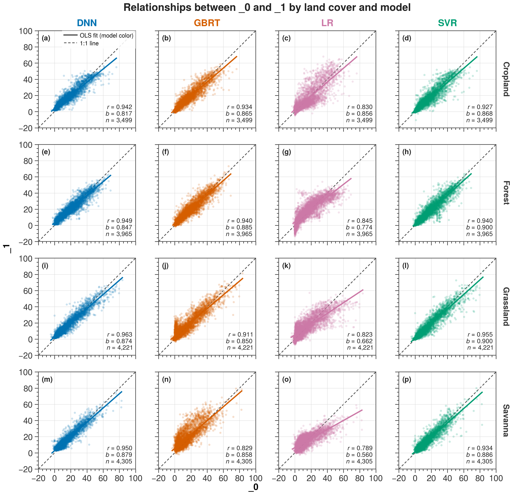

[English](README.md) | **简体中文**

# UltraPlot Skill A/B 测试：相关性散点图

本示例针对同一个相关性散点图任务，对比两次相互独立生成的 UltraPlot 结果。
两组提示词的唯一区别是是否显式调用 `$ultraplot-figures`。

## 输入数据

- 工作簿：[multiple_data.xlsx](data/multiple_data.xlsx)
- 工作表：`Sheet1`
- 规模：4,305 行 × 32 个数值列
- 结构：4 种地类 × 4 种模型 × `_0`/`_1` 配对字段
- 地类：`cropland`、`forest`、`grassland`、`savanna`
- 模型：`DNN`、`GBRT`、`LR`、`SVR`
- 每个地类下各面板有效配对数：3,499、3,965、4,221、4,305
- 16 个面板合计展示 63,960 个有限值配对
- 源数据没有提供单位和描述性变量名，测试中未自行补充。

## 提示词控制

共同任务为：

> 绘图数据文件：`data/multiple_data.xlsx`
>
> 制作一张适合论文使用的相关性散点图，比较 cropland、forest、grassland 和
> savanna 四种地类中，DNN、GBRT、LR、SVR 四种模型下 `_0` 与 `_1` 的关系。
>
> 请提供可直接运行的 Python 代码，导出 PDF 和 PNG。

只有绘图指令发生变化：

| 条件 | 指令 |
|---|---|
| 使用 skill | `请用 [$ultraplot-figures](../../SKILL.md) 制作图件。` |
| 不使用 skill | `请用 UltraPlot 制作图件。` |

## 图件对比

| 使用 `$ultraplot-figures` | 不使用 skill |
|:---:|:---:|
|  |  |

## 输出文件

| 类型 | 使用 `$ultraplot-figures` | 不使用 skill |
|---|---|---|
| 数据处理脚本 | [prepare_correlation_with_skill.py](with_skill/prepare_correlation_with_skill.py) | 数据处理位于绘图脚本中 |
| 绘图脚本 | [plot_correlation_with_skill.py](with_skill/plot_correlation_with_skill.py) | [correlation_scatter_ultraplot.py](without_skill/correlation_scatter_ultraplot.py) |
| PDF | [correlation_scatter_with_skill.pdf](with_skill/correlation_scatter_with_skill.pdf) | [correlation_scatter.pdf](without_skill/correlation_scatter.pdf) |
| PNG | [correlation_scatter_with_skill.png](with_skill/correlation_scatter_with_skill.png) | [correlation_scatter.png](without_skill/correlation_scatter.png) |
| 处理后配对数据 | [correlation_pairs_with_skill.csv](with_skill/correlation_pairs_with_skill.csv) | 不单独写出 |
| 面板统计 | [correlation_stats_with_skill.csv](with_skill/correlation_stats_with_skill.csv) | [correlation_statistics.csv](without_skill/correlation_statistics.csv) |
| 数据审计 | [data_audit_with_skill.json](with_skill/data_audit_with_skill.json) | 由脚本断言并输出到终端 |
| 图件验收 | [verification_with_skill.json](with_skill/verification_with_skill.json) | 脚本内断言与终端报告 |

## 客观输出信息

| 项目 | 使用 `$ultraplot-figures` | 不使用 skill |
|---|---:|---:|
| PDF 页数 | 1 | 1 |
| PDF 页面尺寸 | 183.000 × 187.977 mm | 191.385 × 185.148 mm |
| PNG 像素尺寸 | 7,204 × 7,400 px | 3,013 × 2,915 px |
| PNG 分辨率元数据 | 999.998 dpi | 399.999 dpi |
