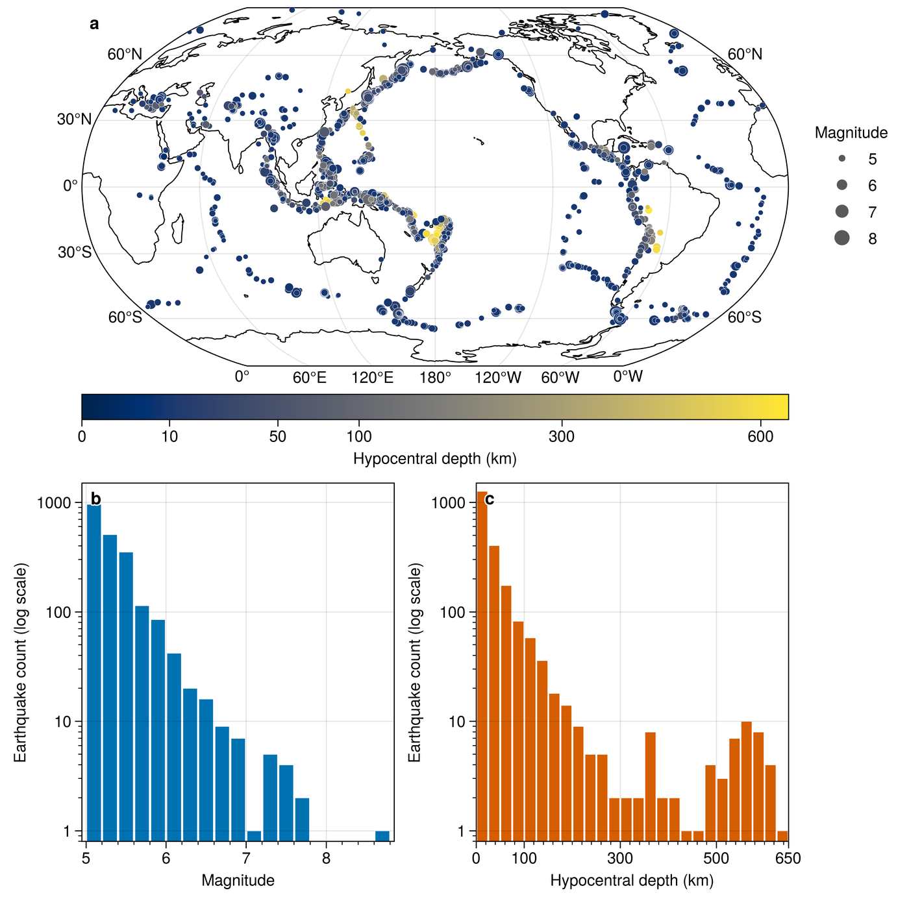
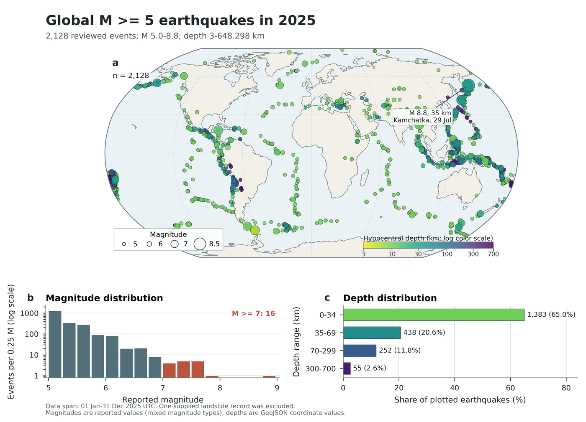

# `ultraplot-figures` 科研绘图对比

本案例使用同一份地震数据和同一条科研绘图提示词，对比允许使用
`$ultraplot-figures` 与不使用任何 skill 两种条件下生成的图件和脚本。

## 测试设置

| 条件 | 使用 skill | 不使用 skill |
|---|---|---|
| Skill 设置 | 只允许 `$ultraplot-figures` | 不允许使用任何 skill |
| 普通 Python 绘图库 | 允许 | 允许，包括直接使用 UltraPlot |
| 输入数据 | 同一份 GeoJSON | 同一份 GeoJSON |
| 科研绘图提示词 | 完全相同 | 完全相同 |
| 生成模型与客户端 | `GPT-5.6 sol`，Codex Desktop for Windows | `GPT-5.6 sol`，Codex Desktop for Windows |

两个分支在共同科研绘图提示词之前分别收到以下设置：

- 使用 skill：`在接下来的任务中，请只使用 $ultraplot-figures，不要使用其他 skill。`
- 不使用 skill：`在接下来的任务中，请不要使用任何 skill。可以直接使用普通 Python 绘图库，包括 UltraPlot。`

- 数据：[USGS 2025 年 M5+ 地震目录](data/usgs_earthquakes_2025_m5plus.geojson)
- 数据来源：[USGS Earthquake Catalog](https://earthquake.usgs.gov/earthquakes/search/)

两组图件的设计、布局和视觉编码均由模型完成，图件生成后未进行人工二次修改。
为便于公开使用，仅将脚本中的本地文件路径替换为仓库相对路径，图形内容未改变。

## 共同提示词

> 请根据下面的数据制作一张适合科研论文使用的图件：
>
> 数据文件：`data/usgs_earthquakes_2025_m5plus.geojson`
>
> 我希望图中能够展示2025年全球M5以上地震的空间分布、震级和深度特征，让读者直观了解这些地震在全球的分布情况及其主要特征。
>
> 请先检查数据内容，再根据数据特点选择合适的图形、布局和视觉表达方式。请保持科学表达谨慎，不要作超出数据支持范围的推断。
>
> 请提供可编辑的Python绘图脚本，以及PDF和高分辨率TIFF图件。

## 图件对比

| 使用 `$ultraplot-figures` | 不使用任何 skill |
|:---:|:---:|
|  |  |

两张预览均由各自最终 TIFF 在白色背景上缩放至 1,400 px 等宽生成，保持原始纵横比，没有裁切、调色或重新排版。

## 输出文件

| 文件 | 使用 `$ultraplot-figures` | 不使用任何 skill |
|---|---|---|
| Python 脚本 | [plot_earthquakes_2025.py](with_skill/plot_earthquakes_2025.py) | [plot_earthquakes_2025.py](without_skill/plot_earthquakes_2025.py) |
| PDF | [earthquakes_2025_m5plus.pdf](with_skill/earthquakes_2025_m5plus.pdf) | [earthquakes_2025_m5plus.pdf](without_skill/earthquakes_2025_m5plus.pdf) |
| TIFF | [earthquakes_2025_m5plus.tif](with_skill/earthquakes_2025_m5plus.tif) | [earthquakes_2025_m5plus_600dpi.tif](without_skill/earthquakes_2025_m5plus_600dpi.tif) |

## 客观文件信息

| 项目 | 使用 `$ultraplot-figures` | 不使用任何 skill |
|---|---:|---:|
| PDF 页数 | 1 | 1 |
| PDF 页面尺寸 | 183.0 × 180.6 mm | 183.0 × 132.0 mm |
| PDF 字体 | 已嵌入；无 Type 3 | 已嵌入；无 Type 3 |
| PDF 内嵌栅格 | 无 | 1 个色标，960 × 48 px，600 dpi |
| TIFF 像素尺寸 | 4322 × 4266 px | 4322 × 3118 px |
| TIFF 分辨率 | 600 dpi | 600 dpi |
| TIFF 色彩模式 | RGB，无 alpha | RGB，无 alpha |
| TIFF 压缩 | LZW | LZW |
| 脚本行数 | 487 | 532 |

## 阅读说明

两种条件分别选择图形、布局和视觉编码，因此版式差异属于案例结果的一部分。
科研图件和代码仍需由研究者结合研究问题、数据来源和投稿要求审核。
