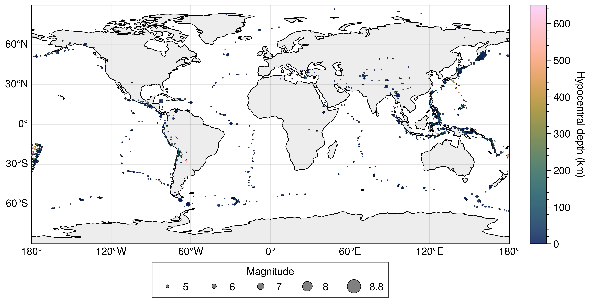

**English** | [简体中文](README_zh.md)

# UltraPlot Skill A/B Test: Global M5+ Earthquakes in 2025

This example compares two independently generated UltraPlot solutions for the same
global-earthquake mapping task. The only prompt difference is whether
`$ultraplot-figures` is explicitly invoked.

## Input data

- GeoJSON: [usgs_earthquakes_2025_m5plus.geojson](data/usgs_earthquakes_2025_m5plus.geojson)
- Source query: USGS FDSN event API, 2025-01-01 through 2026-01-01, minimum magnitude 5
- Features: 2,129 reviewed 3D Point events
- Event-time range: 2025-01-01 04:39:18 UTC to 2025-12-31 14:26:57 UTC
- Magnitude range: 5.0 to 8.8
- Hypocentral-depth range: 0 to 648.298 km
- Longitude range: −179.9105° to 179.9604°
- Latitude range: −65.1723° to 87.0815°
- Missing longitude, latitude, depth, or magnitude values: 0

## Prompt control

The common task was:

> Plotting data file: `data/usgs_earthquakes_2025_m5plus.geojson`
>
> Use UltraPlot to show the spatial distribution, magnitude, and depth
> characteristics of global M5+ earthquakes in 2025, so readers can understand
> their global pattern and major characteristics directly.
>
> Provide directly runnable Python code and export PDF and PNG.

Only the plotting instruction changed:

| Condition | Instruction |
|---|---|
| With skill | `Use [$ultraplot-figures](../../SKILL.md) for plotting.` |
| Without skill | `Use UltraPlot for plotting.` |

## Figure comparison

| With `$ultraplot-figures` | Without skill |
|:---:|:---:|
|  |  |

## Output files

| Type | With `$ultraplot-figures` | Without skill |
|---|---|---|
| Plotting script | [plot_global_earthquakes_with_skill.py](with_skill/plot_global_earthquakes_with_skill.py) | [plot_global_earthquakes_2025.py](without_skill/plot_global_earthquakes_2025.py) |
| PDF | [global_earthquakes_2025_m5plus_with_skill.pdf](with_skill/global_earthquakes_2025_m5plus_with_skill.pdf) | [global_earthquakes_2025_m5plus.pdf](without_skill/global_earthquakes_2025_m5plus.pdf) |
| PNG | [global_earthquakes_2025_m5plus_with_skill.png](with_skill/global_earthquakes_2025_m5plus_with_skill.png) | [global_earthquakes_2025_m5plus.png](without_skill/global_earthquakes_2025_m5plus.png) |
| Verification | [verification_with_skill.json](with_skill/verification_with_skill.json) | Validation and console report in the script |

## Objective output information

| Item | With `$ultraplot-figures` | Without skill |
|---|---:|---:|
| PDF pages | 1 | 1 |
| PDF page size | 183.000 × 94.051 mm | 228.600 × 152.400 mm |
| PNG dimensions | 7,204 × 3,702 px | 2,700 × 1,800 px |
| PNG resolution metadata | 999.998 dpi | 299.999 dpi |
