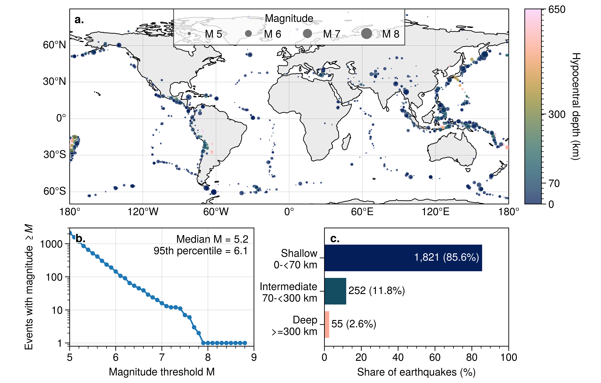
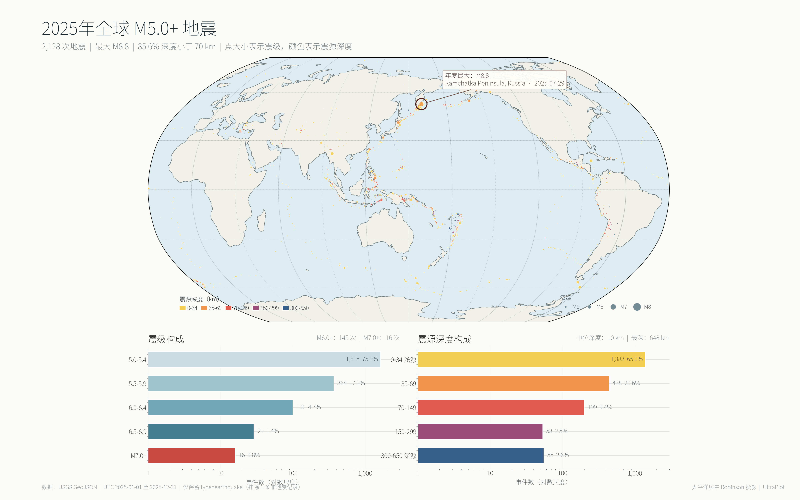

**English** | [Simplified Chinese](README_zh.md)

# UltraPlot Skill A/B Test: Global M5+ Earthquakes in 2025

## Input data

- GeoJSON: [usgs_earthquakes_2025_m5plus.geojson](data/usgs_earthquakes_2025_m5plus.geojson)
- Source features: 2,129
- Retained earthquakes: 2,128
- Explicitly excluded: one feature with `properties.type == "landslide"`
- Magnitude range: M5.0-M8.8; depth range: 3.0-648.298 km

## Prompt control

| Condition | Plotting instruction |
|---|---|
| With skill | `Use [$ultraplot-figures](../../SKILL.md) for plotting.` |
| Without skill | `Use UltraPlot for plotting.` |

Both prompts also requested directly runnable Python code and PDF/PNG exports.

## Figure comparison

### With `ultraplot-figures`

### Without skill

## Retained files

| Type | With skill | Without skill |
|---|---|---|
| Processing | [process_earthquakes.py](with_skill/process_earthquakes.py) | Performed in the plotting script |
| Plotting | [plot_earthquakes.py](with_skill/plot_earthquakes.py) | [plot_earthquakes_2025_ultraplot.py](without_skill/plot_earthquakes_2025_ultraplot.py) |
| Processed events | [earthquakes_2025_m5plus_processed.csv](with_skill/earthquakes_2025_m5plus_processed.csv) | Not written separately |
| Magnitude summary | [magnitude_exceedance.csv](with_skill/magnitude_exceedance.csv) | Computed in memory |
| Depth summary | [depth_classes.csv](with_skill/depth_classes.csv) | Computed in memory |
| Exclusions | [excluded_features.csv](with_skill/excluded_features.csv) | Counted in memory |
| PDF | [earthquakes_2025_m5plus_global.pdf](with_skill/earthquakes_2025_m5plus_global.pdf) | [earthquakes_2025_m5plus_global.pdf](without_skill/earthquakes_2025_m5plus_global.pdf) |
| PNG | [earthquakes_2025_m5plus_global.png](with_skill/earthquakes_2025_m5plus_global.png) | [earthquakes_2025_m5plus_global.png](without_skill/earthquakes_2025_m5plus_global.png) |

## Objective output information

| Item | With skill | Without skill |
|---|---:|---:|
| PDF pages | 1 | 1 |
| PDF page size | 183.000 x 116.638 mm | 406.400 x 254.000 mm |
| PNG dimensions | 7,204 x 4,592 px | 4,800 x 3,000 px |
| PNG resolution metadata | 999.998 dpi | 299.999 dpi |
| Display projection | Plate Carree, central longitude 0 | Robinson, central longitude 150 E |
