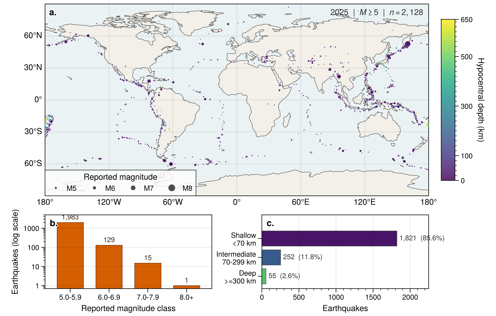
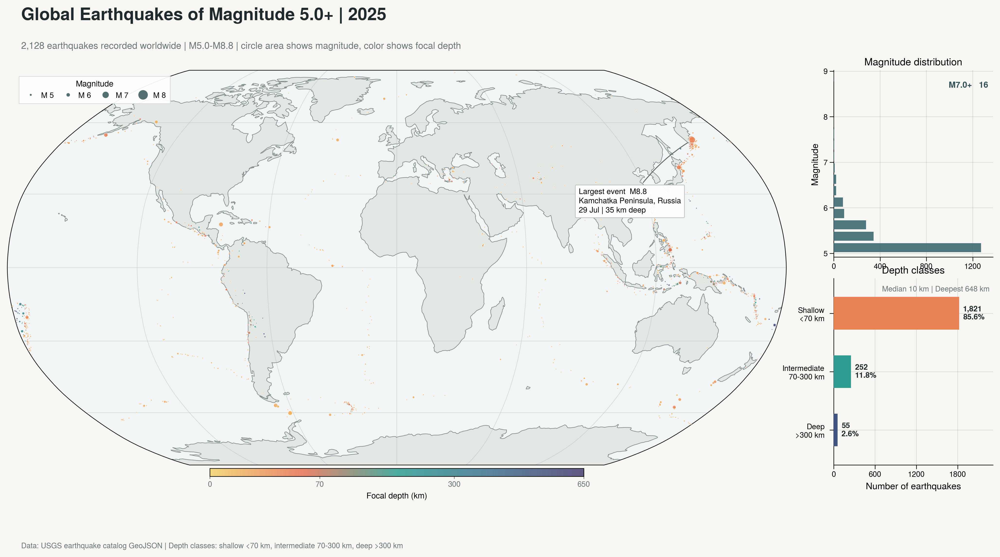

[English](README.md) | **简体中文**

# UltraPlot Skill A/B 测试：2025 年全球 M5+ 地震

## 输入数据

- GeoJSON：[usgs_earthquakes_2025_m5plus.geojson](data/usgs_earthquakes_2025_m5plus.geojson)
- 原始要素数：2,129
- 保留地震数：2,128
- 明确排除：1 条 `properties.type == "landslide"` 的记录
- 震级范围：M5.0-M8.8；深度范围：3.0-648.298 km

## 提示词控制

| 条件 | 绘图指令 |
|---|---|
| 使用 skill | `请使用 [$ultraplot-figures](../../SKILL.md) 绘图。` |
| 不使用 skill | `请使用 UltraPlot 绘图。` |

两组均要求提供可直接运行的 Python 代码并导出 PDF 和 PNG。

## 图件对比

### 使用 `ultraplot-figures`

### 不使用 skill

## 保留文件

| 类型 | 使用 skill | 不使用 skill |
|---|---|---|
| 分析与绘图 | [plot_global_earthquakes.py](with_skill/plot_global_earthquakes.py) | [plot_global_earthquakes_2025.py](without_skill/plot_global_earthquakes_2025.py) |
| PDF | [global_earthquakes_2025_m5plus.pdf](with_skill/global_earthquakes_2025_m5plus.pdf) | [global_earthquakes_2025_m5plus.pdf](without_skill/global_earthquakes_2025_m5plus.pdf) |
| PNG | [global_earthquakes_2025_m5plus.png](with_skill/global_earthquakes_2025_m5plus.png) | [global_earthquakes_2025_m5plus.png](without_skill/global_earthquakes_2025_m5plus.png) |

## 客观输出信息

| 项目 | 使用 skill | 不使用 skill |
|---|---:|---:|
| PDF 页数 | 1 | 1 |
| PDF 页面尺寸 | 182.9996 x 116.6052 mm | 348.3003 x 194.2059 mm |
| PNG 像素尺寸 | 7,204 x 4,590 px | 4,113 x 2,293 px |
| PNG 分辨率元数据 | 999.998 dpi | 299.999 dpi |
| 显示投影 | Plate Carree，中央经线 0 | Robinson，中央经线 0 |
